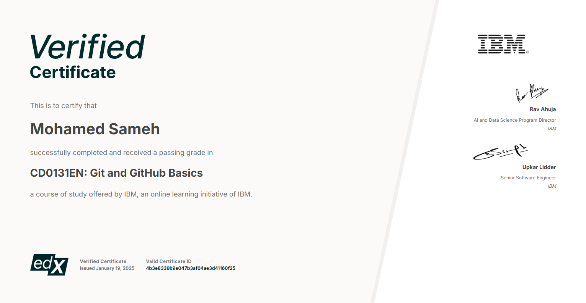

# github-final-project
⚓ The official foundational repository for the final project for IBM's Git and Github basics course.

A calculator that calculates simple interest given principal, annual rate of interest and time period in years.
Input:
   p, principal amount
   t, time period in years
   r, annual rate of interest
Output
   simple interest = p*t*r

## Certificate

